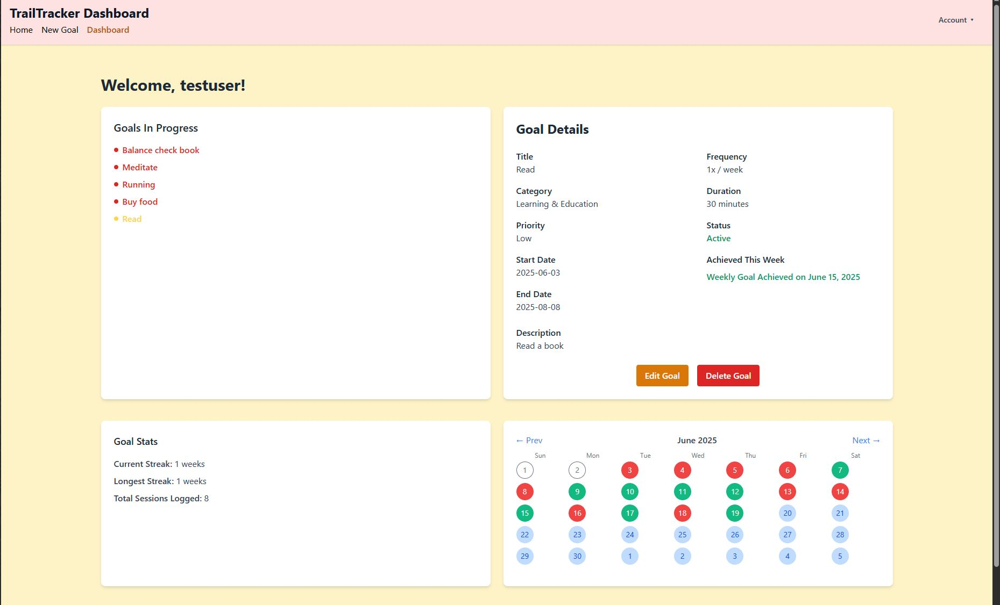

# TrailTracker (Goal-Tracking App)

TrailTracker is a full-stack goal and productivity app designed to help users set intentional goals, track progress, and build consistent habits over time. It emphasizes weekly accountability with session logging, streak tracking, and goal completion logic.

Whether you're working on fitness, learning, or personal development, TrailTracker helps you stay on track - one week at a time.

---

## Features

- Create goals with title, description, category, priority, frequency, and duration
- Calendar view to log daily sessions
- Streak counter and weekly "WasAchieved" logic to mark progress
- Intelligent timezone support for accurate logging
- Update, delete, and view details for each goal
- Stats panel to track streaks and total sessions
- Fully implemented authentication system (secure login/logout with session protection)

---

## Tech Stack

Backend:
- Node.js
- Express.js
- Sequelize ORM
- MariaDB or PostgreSQL
- Express-Session (session management)
- Argon2 (password hashing)

Frontend:
- EJS (templating)
- Tailwind CSS (styling)
- JavaScript

Other Tools:
- Winston (logging)
- Custom middleware for validation and route protection
- Custom date/time logic with JavaScript Date objects

---

## Screenshot

  
Dashboard view: Goals, progress, and calendar tracking.

---

## Getting Started (Local Dev)

### Prerequisites
- Node.js (v18+ recommended)
- MariaDB or PostgreSQL instance running
- Git
- .env file for environment variables (see below)

### Clone the Repo
```
git clone https://github.com/thekenpoist/goal-tracking.git
cd goal-tracking
```

### Install Dependencies
```
npm install
```

### Environment Variables
Create a .env file in the root directory:

```
# Global variables for mariadb access
DB_HOST=your_local_host
DB_USER=your_db_user
DB_PASSWORD=your_db_password
DB_NAME=your_db_name
DB_DIALECT=your_database_engine

# Session secret key
SESSION_SECRET=your_super_secret_key
# resend API access key
RESEND_API_KEY=your_email_api_key
```

### Run Migrations (if using Sequelize CLI)
```
npx sequelize-cli db:migrate
```

### Start the Server
```
npm run dev
```

Then open your browser to http://localhost:3000

---

## Roadmap

- Reminders system (email/text)
- Mobile optimization
- React frontend (migrating from EJS)

---

## About

TrailTracker is a personal project by [Steve Hull](https://github.com/thekenpoist), an Aerospace Engineer, rancher, martial artist, and full-stack developer who builds software grounded in real-world utility. The app reflects a hybrid lifestyle — part rancher, part developer — and is built to help others build grit and consistency through actionable goals.

---

## License

GNU GENERAL PUBLIC LICENSE